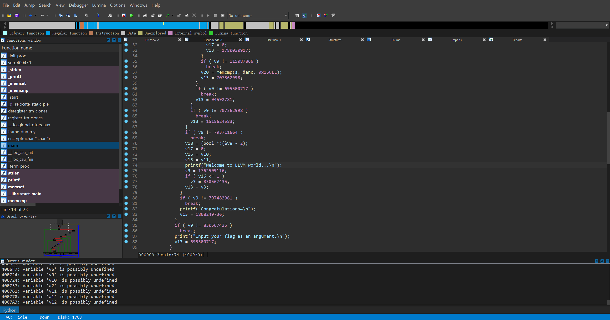
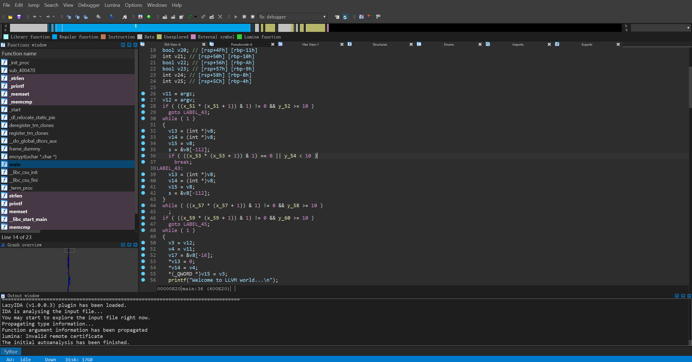
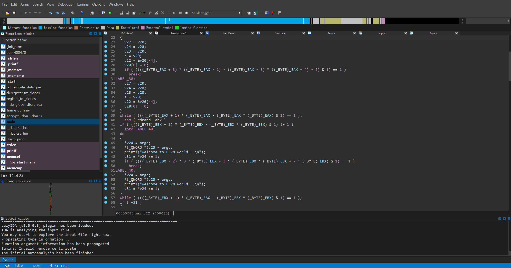
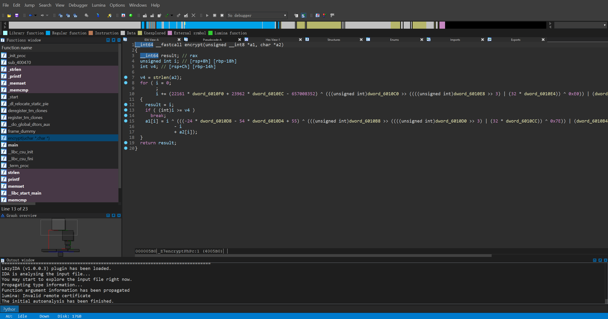

# OLLVM++
Obfuscator refactored and extended from OLLVM.
## Environment
- Ubuntu 18.04.5 LTS
- LLVM 12.0.1
- Clang 12.0.1
- CMake 3.21.1
## Features
### Control Flow Flattening

### Bogus Control Flow

### Instruction Substitution

### Random Control Flow

### Constant Substitution

